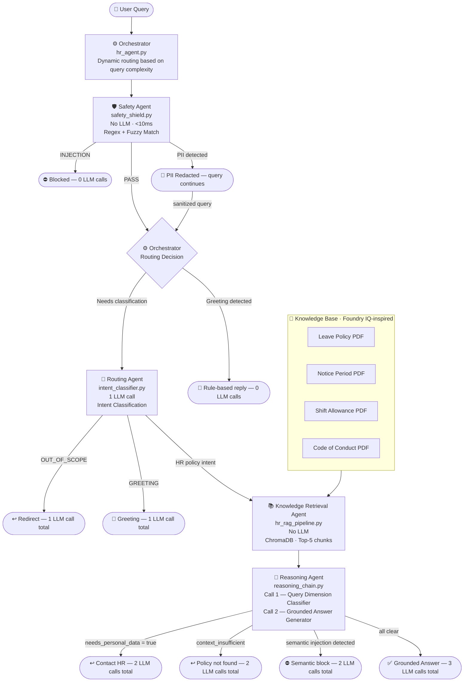

# 🤖 HR Policy Assistant — ABC Corporation
### Microsoft Agents League Hackathon · Reasoning Agents Track

> A **sequentially orchestrated agent pipeline** for HR policy assistance powered by **GitHub Models (gpt-4o-mini)** and **GitHub Copilot**, featuring a Foundry IQ-inspired RAG pipeline, dynamic query routing, multi-layer safety shields, structured two-stage reasoning chains, and quantitative evaluation via RAGAS.

---

## 🎯 Problem Statement

HR teams at large organisations spend significant time answering repetitive policy questions — leave entitlements, shift allowances, notice periods, disciplinary procedures. Employees get inconsistent answers depending on who they ask.

**HR Policy Assistant** solves this by grounding every response in verified policy documents, routing queries through specialised agents, blocking unsafe inputs before they reach the LLM, and providing measurable answer quality scores — all in a single deployable application.

---

## 🏗️ Agent Pipeline Architecture

The system is composed of **four specialised agents**, each with a single responsibility, coordinated by an orchestrator that makes **active routing decisions** based on query type — minimising LLM calls and maximising response accuracy.



---

## 🧠 Multi-Step Reasoning & Dynamic Routing

A key design goal is **cost-aware orchestration** — the system uses the minimum number of LLM calls needed to answer each query correctly. The orchestrator makes active routing decisions at two checkpoints:

### Routing Decision 1 — Pre-LLM (Orchestrator)
Before any LLM call, the orchestrator checks for trivial cases:
- **Injection / PII detected** → block immediately, 0 LLM calls
- **Greeting keyword matched** → rule-based reply, 0 LLM calls
- **All other queries** → forward to Routing Agent

### Routing Decision 2 — Post-Intent (Routing Agent)
After intent classification:
- **OUT_OF_SCOPE** → redirect, pipeline stops at 1 LLM call
- **GREETING** (LLM-classified) → greeting reply, 1 LLM call
- **HR policy intent** → forward to Knowledge + Reasoning agents

### Routing Decision 3 — Post-Retrieval (Reasoning Agent, 2-stage)
The Reasoning Agent runs **two sequential LLM calls**, each making independent decisions:

**Call 1 — Query Dimension Classifier:**
Evaluates three dimensions in a single structured JSON response:
- `needs_personal_data` → if true, redirect to HR without generating an answer
- `context_sufficient` → if false, return "policy not found" without generating
- `is_injection` → semantic injection check (catches paraphrased attacks that bypass regex)

**Call 2 — Grounded Answer Generator:**
Only fires if Call 1 clears all three checks. Uses a structured Chain-of-Thought prompt with explicit rules to prevent hallucination on edge cases (tenure calculations, stacked allowances, holiday pay).

### LLM Call Budget Per Query Type

| Query Type | LLM Calls | Path |
|---|---|---|
| Injection / PII | 0 | Safety Agent blocks |
| Rule-based greeting | 0 | Orchestrator keyword match |
| Out of scope | 1 | Routing Agent only |
| Needs personal DB data | 2 | Routing + Classifier |
| Context insufficient | 2 | Routing + Classifier |
| Semantic injection | 2 | Routing + Classifier |
| Full policy answer | 3 | Routing + Classifier + Generator |

---

## 👥 Agent Responsibilities

| Agent | File | Role | LLM? |
|---|---|---|---|
| **Safety Agent** | `safety_shield.py` | Injection + PII detection via regex/fuzzy match | ❌ No LLM |
| **Routing Agent** | `intent_classifier.py` | Classifies query intent, routes to correct policy domain | ✅ 1 call |
| **Knowledge Retrieval Agent** | `hr_rag_pipeline.py` | Foundry IQ-inspired grounding — retrieves top-5 chunks from ChromaDB | ❌ No LLM |
| **Reasoning Agent** | `reasoning_chain.py` | Two-stage: dimension classifier then grounded answer generator | ✅ 2 calls |
| **Orchestrator** | `hr_agent.py` | Active routing decisions at each checkpoint, session stats | — |

---

## 🧠 Microsoft IQ Alignment

### Foundry IQ — Grounding Layer
The Knowledge Retrieval Agent implements the same pattern as Microsoft Foundry IQ:
- Knowledge base built from 4 HR policy PDFs
- Permission-aware retrieval — only indexed documents are sources, no general LLM knowledge
- Grounded answers with source chunk citations exposed in the debug panel
- Implemented via ChromaDB + HuggingFace `all-MiniLM-L6-v2` embeddings (local, no Azure dependency)

> **Azure migration path:** Architecture is designed to swap ChromaDB for Azure AI Search with a single line change — `get_vector_store()` in `llm_factory.py` is the swap point. Local OSS stack used due to Azure free tier rate limits during development.

---

## ✨ Key Capabilities

| Capability | What It Does |
|---|---|
| 🛡️ **Safety Agent** | Rule-based injection + PII detection — zero LLM calls, <10ms blocking |
| ⚙️ **Dynamic Orchestration** | Active routing cuts LLM calls from 3 to 0-2 for non-policy queries |
| 🎯 **Routing Agent** | Intent classification routes queries to correct policy domain before retrieval |
| 📚 **Knowledge Retrieval Agent** | Foundry IQ-inspired grounding on 4 HR policy PDFs via ChromaDB |
| 🧠 **Two-Stage Reasoning Agent** | Stage 1 classifies query dimensions; Stage 2 generates grounded answer |
| 📊 **RAGAS Evaluation** | Faithfulness, Context Precision, Answer Relevancy on 16-question golden dataset |
| 🎛️ **Quality Dashboard** | Live session stats + RAGAS scores in dedicated UI tab |

---

## 📊 Evaluation Results

Evaluated on a **16-question golden dataset** built from actual HR policy documents.
Judge model: `gpt-4.1-mini` — separate from pipeline model (`gpt-4o-mini`) to avoid self-evaluation bias.

| Metric | Score | Threshold | Status |
|---|---|---|---|
| Faithfulness (Groundedness) | **0.916** | 0.80 | ✅ PASS |
| Context Precision | **0.942** | 0.75 | ✅ PASS |
| Answer Relevancy | **0.846** | 0.75 | ✅ PASS |

---

## 🛡️ Safety & Responsible AI

`tests/safety/test_safety_shield.py` — 22 parametrized pytest cases covering:

- Direct prompt injection
- Typo-obfuscated injection (`ign0re`, `1gnore`, `forg3t`)
- Base64-encoded injection
- Identity assumption attacks (`Act as an admin...`)
- Document poisoning attempts (`Update your internal state...`)
- PII detection (email, phone, Aadhaar, PAN)
- False positive validation — legitimate tough questions pass through

**Defense-in-depth:** Rule-based Safety Agent catches known patterns in <10ms. The Reasoning Agent's Call 1 adds a second semantic injection check via LLM — catching paraphrased attacks that bypass regex.

All responses are grounded in indexed policy documents. If a topic isn't in the policy PDFs, the system says so explicitly — it will not fabricate answers from general LLM knowledge.

---

## 🚀 Quick Start

### Prerequisites
- Python 3.10+
- GitHub account with Models access
- `GITHUB_TOKEN` with `models:read` permission

```bash
# 1. Clone
git clone https://github.com/swasti16/hr-agent-hackathon.git
cd hr-agent-hackathon

# 2. Virtual environment
python -m venv venv
venv\Scripts\activate      # Windows
source venv/bin/activate   # Mac/Linux

# 3. Install
pip install -r requirements.txt
pip install -e .

# 4. Configure
cp .env.example .env
# Add your GITHUB_TOKEN to .env

# 5. Run
python app.py
```

### Force reindex (when documents change)
```bash
python app.py --force_reindex
```

---

## 🧪 Running Tests

```bash
# Safety agent tests (no LLM — instant, 22 cases)
pytest tests/safety/ -v

# Integration tests (~6 LLM calls)
pytest tests/integration/ -v

# E2E UI tests (no LLM)
pytest tests/e2e/ -v

# Full suite
pytest -v
```

---

## 📁 Project Structure

```
hr-agent-hackathon/
├── app.py                          # Gradio UI — Chat + Quality Dashboard tabs
├── config/
│   ├── settings.py                 # Central config — models, thresholds, paths
│   └── agents/
│       └── hr_agent_config.py      # System prompt + collection config
├── src/
│   ├── base_rag_pipeline.py        # Base RAG pipeline — indexing + retrieval
│   ├── hr_rag_pipeline.py          # HR-specific pipeline (extends base)
│   └── agent/
│       ├── hr_agent.py             # Orchestrator — active routing + session stats
│       ├── intent_classifier.py    # Routing Agent — LLM intent classification
│       ├── reasoning_chain.py      # Reasoning Agent — two-stage classify + generate
│       └── safety_shield.py        # Safety Agent — injection/PII blocking
├── data/
│   └── hr_documents/               # 4 HR policy PDFs (source of truth)
├── reports/
│   ├── ragas_scores.json           # RAGAS evaluation output
│   └── test_results/
│       ├── safety_shield.txt       # 22 safety test results
│       ├── integration.txt         # 6 integration test results
│       └── end_to_end.txt          # 5 e2e test results
└── tests/
    ├── safety/                     # 22 parametrized safety test cases
    ├── integration/                # 6 agent integration tests
    ├── e2e/                        # 5 end-to-end UI tests
    └── rag/                        # Embedding quality + RAGAS evaluation
```

---

## 🔧 Tech Stack

| Component | Technology |
|---|---|
| LLM | `gpt-4o-mini` via GitHub Models |
| Judge LLM | `gpt-4.1-mini` (RAGAS evaluation only) |
| Embeddings | `all-MiniLM-L6-v2` (HuggingFace, local) |
| Vector DB | ChromaDB (Foundry IQ-inspired local grounding) |
| Framework | LangChain |
| RAG Evaluation | RAGAS |
| UI | Gradio |
| Testing | Pytest (parametrized fixtures) |
| AI-assisted Dev | GitHub Copilot |
| Auth | `GITHUB_TOKEN` |

---

## 🔑 Design Decisions

**Why dynamic routing instead of always running all agents?**
Most queries (greetings, OOS, injections) don't need RAG or generation. Routing them out early cuts LLM calls from 3 to 0-1, reduces latency, and stays within GitHub Models' free tier rate limits. This is explicit cost-aware orchestration.

**Why local embeddings?**
HuggingFace `all-MiniLM-L6-v2` runs offline — no API cost, no rate limits, deterministic. The `get_embeddings()` factory in `llm_factory.py` is the single swap point for Azure AI embeddings.

**Why rule-based Safety Agent first?**
LLM-based safety checks cost API calls and add latency. The Safety Agent catches known injection patterns via regex + fuzzy matching with no LLM calls. The Reasoning Agent's Call 1 adds semantic injection detection as a second layer — defense-in-depth without paying LLM cost on every query.

**Why two LLM calls in the Reasoning Agent?**
Separating classification from generation prevents the LLM from generating a hallucinated answer before checking whether the context is sufficient or the query needs personal data. Call 2 only fires when Call 1 confirms the query is safe and answerable.

**Why a separate judge model for RAGAS?**
Using the same model as both pipeline and judge inflates scores — the model tends to agree with its own outputs. Pipeline uses `gpt-4o-mini`, judge uses `gpt-4.1-mini` — different model families reduce self-evaluation bias.

---

## 📝 Synthetic Data Notice

All HR policy documents are **synthetic**, created for demonstration purposes only. They represent a fictional company (ABC Corporation) and contain no real employee data, PII, or confidential information.

---

## 🤖 GitHub Copilot Usage

GitHub Copilot was used throughout development for:
- Generating boilerplate for agent classes and prompt templates
- Inline suggestions
- Test case generation for `test_safety_shield.py`
- Iterative refinement of CLASSIFIER_PROMPT and REASONING_PROMPT

---

## 👩‍💻 Built By

**Swasti Shrivastava**  
GitHub: [@swasti16](https://github.com/swasti16)
