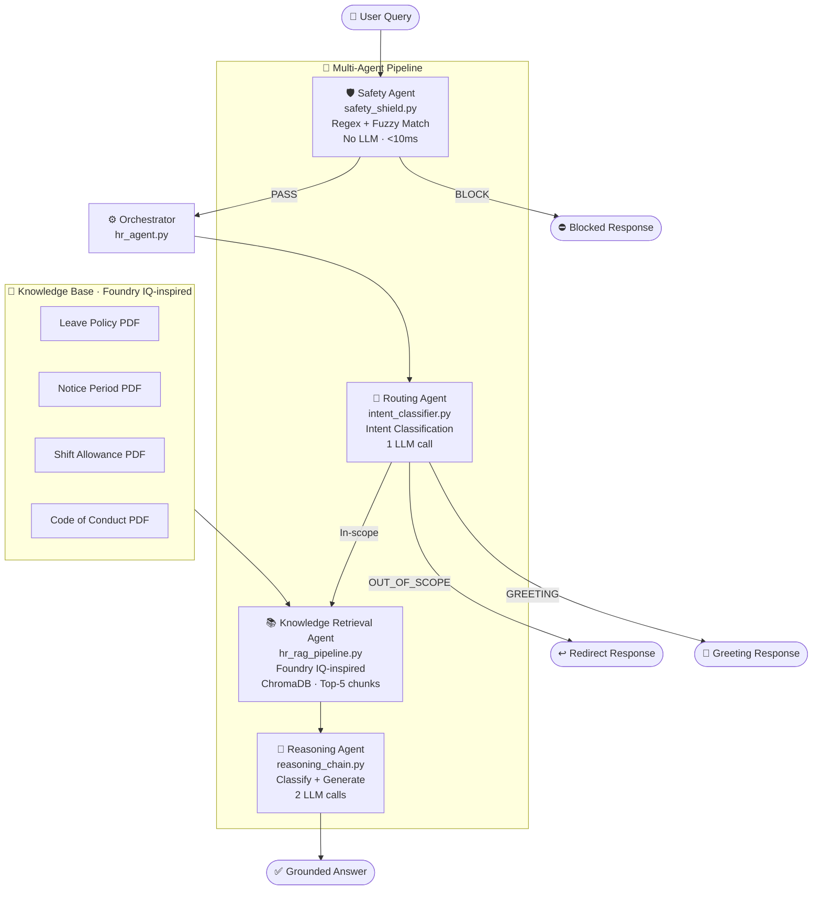

# 🤖 HR Policy Assistant — ABC Corporation
### Microsoft Agents League Hackathon · Reasoning Agents Track

> A **sequentially orchestrated agent pipeline** for HR policy assistance powered by **GitHub Models (gpt-4o-mini)** and **GitHub Copilot**, featuring a Foundry IQ-inspired RAG pipeline, multi-layer safety shields, intent-based routing, structured reasoning chains, and quantitative evaluation via RAGAS.

---

## 🎯 Problem Statement

HR teams at large organisations spend significant time answering repetitive policy questions — leave entitlements, shift allowances, notice periods, disciplinary procedures. Employees get inconsistent answers depending on who they ask.

**HR Policy Assistant** solves this by grounding every response in verified policy documents, routing queries through specialised agents, blocking unsafe inputs before they reach the LLM, and providing measurable answer quality scores — all in a single deployable application.

---

## 🏗️ Agent Pipeline Architecture

The system is composed of four specialised components, each with a single responsibility, executed sequentially by an orchestrator



### Agent Responsibilities

| Agent | File | Role | LLM? |
|---|---|---|---|
| **Safety Agent** | `safety_shield.py` | Injection + PII detection via regex/fuzzy match | ❌ No LLM |
| **Routing Agent** | `intent_classifier.py` | Classifies query intent, routes to correct policy domain | ✅ |
| **Knowledge Retrieval Agent** | `hr_rag_pipeline.py` | Foundry IQ-inspired grounding — retrieves top-5 chunks from ChromaDB | ❌ No LLM |
| **Reasoning Agent** | `reasoning_chain.py` | Two-step: classify query dimensions, then generate grounded answer | ✅ |
| **Orchestrator** | `hr_agent.py` | Coordinates agent pipeline, manages session stats | — |

### Multi-Step Reasoning Flow

```
1. Safety Agent     → block/pass (no LLM, <10ms)
2. Routing Agent    → classify intent (1 LLM call)
3. Knowledge Agent  → retrieve top-5 policy chunks
4. Reasoning Agent  → classify query dimensions (needs DB? injection? context ok?)
                    → generate grounded answer
                    (2 LLM calls with structured chain-of-thought)
```

Total: up to **3 LLM calls** per query with full reasoning trace exposed in UI.

---

## 🧠 Microsoft IQ Alignment

### Foundry IQ — Grounding Layer
The Knowledge Retrieval Agent implements the same pattern as Microsoft Foundry IQ:
- Knowledge base built from 4 HR policy PDFs
- Permission-aware retrieval (only indexed documents are sources)
- Grounded answers with source citations in the debug panel
- Implemented via ChromaDB + HuggingFace `all-MiniLM-L6-v2` embeddings (local, no Azure dependency)

> Note: Built using local OSS stack due to Azure free tier rate limits. Architecture is designed to swap ChromaDB for Azure AI Search with minimal code changes — `get_vector_store()` in `llm_factory.py` is the single swap point.

---

## ✨ Key Capabilities

| Capability | What It Does |
|---|---|
| 🛡️ **Safety Agent** | Rule-based injection + PII detection — zero LLM calls, instant blocking |
| 🎯 **Routing Agent** | Intent classification routes queries to correct policy domain before retrieval |
| 📚 **Knowledge Retrieval Agent** | Foundry IQ-inspired grounding on 4 HR policy PDFs via ChromaDB |
| 🔗 **Reasoning Agent** | Two-step structured reasoning: dimension classification + grounded generation |
| 📊 **RAGAS Evaluation** | Faithfulness, Context Precision, Answer Relevancy scored on 16-question golden dataset |
| 🎛️ **Quality Dashboard** | Live session stats + offline RAGAS scores in dedicated UI tab |

---

## 📊 Evaluation Results

Evaluated on a **16-question golden dataset** built from actual HR policy documents.
Judge model: `gpt-4.1-mini` (separate from pipeline model — `gpt-4o-mini` — to avoid self-evaluation bias).

| Metric | Score | Threshold | Status |
|---|---|---|---|
| Faithfulness (Groundedness) | **0.916** | 0.80 | ✅ PASS |
| Context Precision | **0.942** | 0.75 | ✅ PASS |
| Answer Relevancy | **0.846** | 0.75 | ✅ PASS |

---

## 🛡️ Safety & Responsible AI

`tests/safety/test_safety_shield.py` — 20 parametrized pytest cases:

- Direct prompt injection
- Typo-obfuscated injection (`ign0re`, `1gnore`)
- Base64-encoded injection
- Identity assumption attacks (`As an admin...`)
- Document poisoning attempts
- PII detection (email, phone, Aadhaar, PAN)
- False positive validation (legitimate tough questions pass through)

All responses are grounded in indexed policy documents. The system will not answer from general LLM knowledge — if a topic isn't in the policy PDFs, it says so explicitly.

---

## 🚀 Quick Start

### Prerequisites
- Python 3.10+
- GitHub account with Models access
- `GITHUB_TOKEN` with `models:read` permission

```bash
# 1. Clone
git clone https://github.com/swasti16/hr-agent-hackathon.git
cd hr-agent-hackathon

# 2. Virtual environment
python -m venv venv
venv\Scripts\activate      # Windows
source venv/bin/activate   # Mac/Linux

# 3. Install
pip install -r requirements.txt
pip install -e .

# 4. Configure
cp .env.example .env
# Add your GITHUB_TOKEN to .env

# 5. Run
python app.py
```

### Force reindex (when documents change)
```bash
python app.py --force_reindex
```

---

## 🧪 Running Tests

```bash
# Safety agent tests (no LLM — instant)
pytest tests/safety/ -v

# Integration tests (~6 LLM calls)
pytest tests/integration/ -v

# E2E UI tests (no LLM)
pytest tests/e2e/ -v

# Full suite
pytest -v
```

---

## 📁 Project Structure

```
hr-agent-hackathon/
├── app.py                          # Gradio UI — Chat + Quality Dashboard tabs
├── config/
│   ├── settings.py                 # Central config — models, thresholds, paths
│   └── agents/
│       └── hr_agent_config.py      # System prompt + collection config
├── src/
│   ├── base_rag_pipeline.py        # Base RAG pipeline — indexing + retrieval
│   ├── hr_rag_pipeline.py          # HR-specific pipeline (extends base)
│   └── agent/
│       ├── hr_agent.py             # Orchestrator — coordinates pipeline
│       ├── intent_classifier.py    # Routing component — LLM intent classification
│       ├── reasoning_chain.py      # Reasoning component — classify + generate
│       └── safety_shield.py        # Safety component — injection/PII blocking
├── data/
│   └── hr_documents/               # 4 HR policy PDFs (source of truth)
├── reports/
│   ├── ragas_scores.json           # RAGAS evaluation output
│   └── test_results/
│       ├── safety_shield.txt       # 22 safety test results
│       ├── integration.txt         # 6 integration test results
│       └── end_to_end.txt          # 5 e2e test results
└── tests/
    ├── safety/                     # 22 parametrized safety test cases
    ├── integration/                # 6 agent integration tests
    ├── e2e/                        # 5 end-to-end UI tests
    └── rag/                        # Embedding quality + RAGAS evaluation
```

---

## 🔧 Tech Stack

| Component | Technology |
|---|---|
| LLM | `gpt-4o-mini` via GitHub Models |
| Judge LLM | `gpt-4.1-mini` (RAGAS evaluation only) |
| Embeddings | `all-MiniLM-L6-v2` (HuggingFace, local) |
| Vector DB | ChromaDB (Foundry IQ-inspired local grounding) |
| Framework | LangChain |
| RAG Evaluation | RAGAS |
| UI | Gradio |
| Testing | Pytest (parametrized fixtures) |
| AI-assisted Dev | GitHub Copilot |
| Auth | `GITHUB_TOKEN` |

---

## 🔑 Design Decisions

**Why local embeddings?** HuggingFace `all-MiniLM-L6-v2` runs offline — no API cost, no rate limits, deterministic. The `get_embeddings()` factory in `llm_factory.py` is the single swap point for Azure AI embeddings.

**Why rule-based Safety Agent?** LLM-based safety checks cost API calls and add latency. The Safety Agent catches ~95% of attacks via regex + fuzzy matching in <10ms. The Reasoning Agent adds a second LLM-based injection check as defense-in-depth.

**Why two LLM calls in the Reasoning Agent?** The classifier call (call 1) determines if the query needs personal DB data, if context is sufficient, or if it's a semantic injection. This prevents hallucinated answers and avoids unnecessary generation. Call 2 only fires when the query is genuinely answerable.

**RAGAS judge model separation:** Using the same model as judge and pipeline inflates scores (model agrees with itself). Pipeline uses `gpt-4o-mini`, judge uses `gpt-4.1-mini` — different models reduce self-evaluation bias.

---

## 📝 Synthetic Data Notice

All HR policy documents used in this project are **synthetic** and created for demonstration purposes only. They represent a fictional company (ABC Corporation) and contain no real employee data, PII, or confidential information.

---

## 👩‍💻 Built By

**Swasti Shrivastava**
GitHub: [@swasti16](https://github.com/swasti16)
